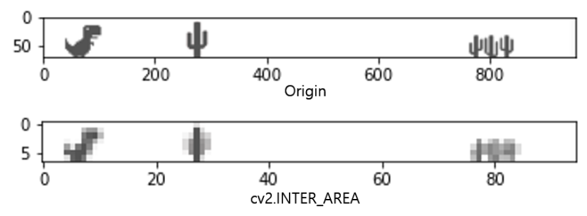
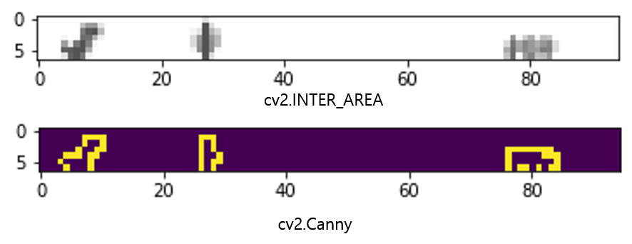

# Chromedino-tf-dqn-gym

---
This project implements the DQN (Deep Q-Network) algorithm with image pixel input using the [gym-chrome-dino](https://github.com/mattstruble/gym-chrome-dino) environment. The goal is to train an agent to play the Chrome Dino game using reinforcement learning.

 

### Preprocessing

  

The gym environment provides image pixels as the state. To preprocess the input image, we use interpolation and edge detection techniques using the OpenCV (cv2) module. Since the agent operates in real-time, it is crucial for the preprocessing step to be fast. By reducing the input size of the image, we can speed up the preprocessing and ensure that the agent can make quick decisions based on the current game state.
The image below shows an example of the preprocessing steps applied to the game screen:

interpolation

canny edge detection

---

### Action Space

The agent can choose from three actions:

+ Jump
+ Duck
+ Stand

---

### Reward System

The reward system is designed to encourage the agent to survive longer in the game. The rewards are as follows:

+ -10 reward for agent death

+ +1 reward for each step of survival

---

### RL algorithm

  
We employ the DQN algorithm using TensorFlow to train the agent. The agent explores or exploits based on the Epsilon Greedy Algorithm. During exploration, the agent chooses a random action, while during exploitation, it selects the action with the highest Q-value.
The Q-function is updated using the Q-learning algorithm, which helps the agent learn the optimal policy.
